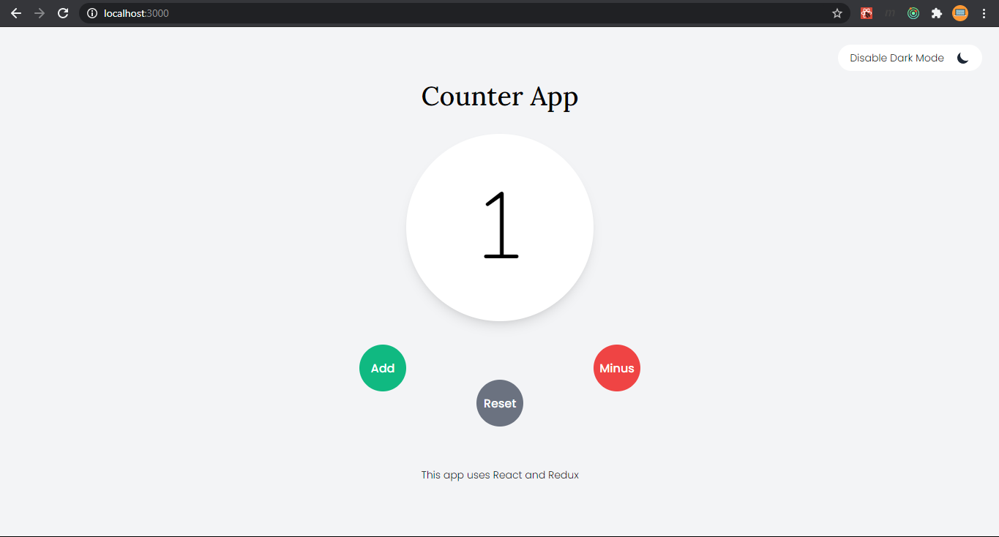
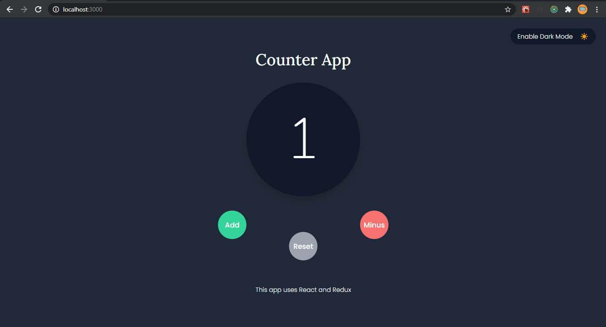

# Counter-react-redux-app

A counter app made using [React](https://reactjs.org/) and [React-Redux](https://react-redux.js.org/)

## 📑 Table of contents


  - [📕 Introduction](#-introduction)
  - [🚀 Installation](#-installation)
  - [🖼 Pictures](#-pictures)
  - [⚙ Demo](#-demo)

### 📕 Introduction

- A counter application built using [React](https://reactjs.org/) which does the following :

  1. **Adds** count when _add button_ is clicked
  2. **Subtracts** count when _minus button_ is clicked
  3. **Reset** when _reset button_ is clicked
  4. **Toggle between theme(Light/ Dark)** when _theme button_ is clicked

- To keep track on state, we use [React-Redux](https://react-redux.js.org/)

### 🚀 Installation

- To clone this project :

```bash
git clone "https://github.com/Noobsiecoder/counter-react-redux-app.git"
```

- To run this project :

```bash
# Check if both npm and node are installed
npm --version && node --version

# Download required npm packages
npm i

# Run react app
npm start

# Build react app
npm run build
```

### 🖼 Pictures




### ⚙ Demo

[Counter React Redux App demo link](https://counter-react-redux-app.netlify.app)
